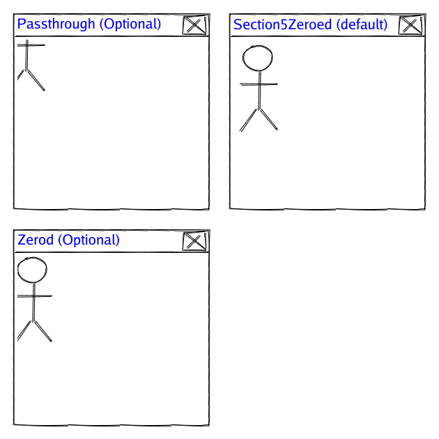

# Frame

A simple golang library that creates an image.Image compatible object (ideally used with draw.Draw) that can be used for drawing a frame around something else. Think like a window, button, or anything else. 

It works by splitting an image into 9 parts:


Parts, 1, 3, 7 and 9 are drawn exactly as is. Then the remaining parts
are repeated or stretched to match the content as required.

Other variants might be created such as ones which are more procedurally generated or allow more interesting
views.

# Contributions

This is a simple library I am reusing else where. PRs reviewed and probably accepted. But definitely appreciated.

# Doc

There is basic go doc which you can check out here:
https://pkg.go.dev/github.com/arran4/frame

The intended way of using this is:
```go
	fr := NewBasicFrame(targetArea)
	dst := i.SubImage(targetArea).(draw.Image)
	draw.Draw(dst, dst.Bounds(), fr, dst.Bounds().Min, draw.Src)
```

# Usage

## Sample 2: Drawing borders

Simplest possible use case; take an image and expand it to fit the 
desired size.

```go
	base, err := png.Decode(bytes.NewReader(baseImageData))
	if err != nil {
		log.Panicf("Error with loading base file: %s", err)
	}
	i := image.NewRGBA(image.Rect(0, 0, 600, 600))
	dst := i.SubImage(image.Rect(100, 100, 400, 400)).(draw.Image)
	fr := frame.NewFrame(dst.Bounds(), base, image.Rect(48,48,55, 66))
	draw.Draw(dst, dst.Bounds(), fr, dst.Bounds().Min, draw.Src)
	SaveFile(i)
```

Which will produce:


From:


## Sample 3: Section 5 image

This creates a better window implementation than sample 2. But also it shows that the way the borders
are drawn can be changed. As you can almost see in sample 2 the borders aren't drawn well as it's simply
repeating the contents. You can also use a (simple) stretch version instead of the repeating version. 
This is done with the `BorderMode` options see:
```go
	fr := frame.NewFrame(frdst.Bounds(), base.(SubImagable).SubImage(s2), image.Rect(14, 48, 88, 66), frame.Repeating)
	fr := frame.NewFrame(frdst.Bounds(), base.(SubImagable).SubImage(s2), image.Rect(14, 48, 88, 66), frame.Stretched)
```
See the sample for a more detailed look at the code. However, the difference this creates is as follows:


From: 


## Sample 4

In sample 4 we replace the contents of the window with our own rather than use section 5 of the image.

There are currently 3 variants of this:
* Section5Zeroed - Match section 5 starting position with co-ordinates 0, 0
* Zerod - Match the whole frame's starting position with the co-ordinates 0, 0
* PassThrough - Pass in the parent windows position

```go
fr := frame.NewFrame(frdst.Bounds(), base.(SubImagable).SubImage(s2), image.Rect(14, 48, 88, 66), &frame.Section5{s5i}, frame.Section5Zeroed)
fr := frame.NewFrame(frdst.Bounds(), base.(SubImagable).SubImage(s2), image.Rect(14, 48, 88, 66), &frame.Section5{s5i}, frame.Zerod)
fr := frame.NewFrame(frdst.Bounds(), base.(SubImagable).SubImage(s2), image.Rect(14, 48, 88, 66), &frame.Section5{s5i}, frame.PassThrough) 
```

Which draws:



From the frame:


And with the section 5 image: 


Please note, currently there is no support / consideration for an image with a none 0,0 Rectangle.Min
position. This might change so ensure your code will handle this. 

## Sample 4: Simple static image

```go

func NewBasicFrame(r image.Rectangle) *Frame {
	middle := image.Rect(0, 0, 1, 1)
	base := image.NewRGBA(image.Rect(-2, -2, 2, 2))
	b := base.Bounds()
	for y, r := range [][]color.RGBA{
		{colornames.Lightgray, colornames.Lightgray, colornames.Lightgray, colornames.Lightgray, colornames.Lightgray},
		{colornames.Lightgray, colornames.Darkgrey, colornames.Darkgrey, colornames.Darkgrey, colornames.Lightgray},
		{colornames.Lightgray, colornames.Darkgrey, colornames.White, colornames.Darkgrey, colornames.Lightgray},
		{colornames.Lightgray, colornames.Darkgrey, colornames.Darkgrey, colornames.Darkgrey, colornames.Lightgray},
		{colornames.Lightgray, colornames.Lightgray, colornames.Lightgray, colornames.Lightgray, colornames.Lightgray},
	} {
		for x, c := range r {
			base.Set(b.Min.X + x, b.Min.Y + y, c)
		}
	}
	return NewFrame(r, base, middle)
}

func main() {
    i := image.NewRGBA(image.Rect(0, 0, 150, 100))
    targetArea := image.Rect(10, 10, 100, 30)
    fr := NewBasicFrame(targetArea)
    dst := i.SubImage(targetArea).(draw.Image)
    draw.Draw(dst, dst.Bounds(), fr, dst.Bounds().Min, draw.Src)
}

```

Noting really amazing here but no need to have files, if you just want to draw a simple border you can 
do it this way, you might be able to wrap `image.NewUniform(color goes here).Bounds()` with a more restricted version. 

